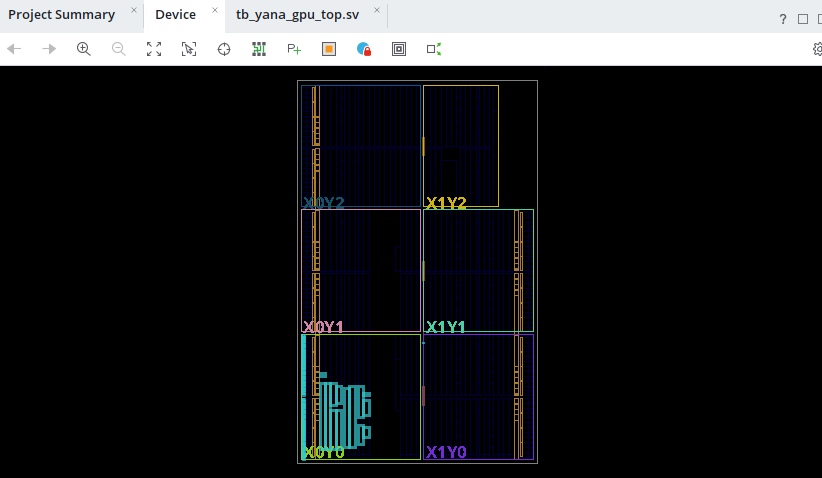
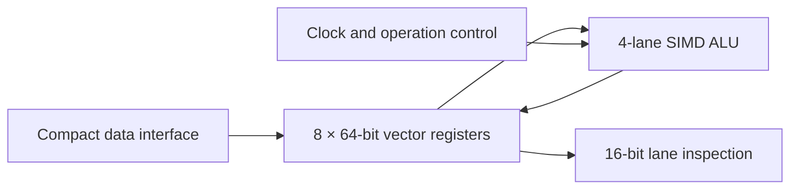

<div align="center">

# YanaGPU

### A Custom FPGA-Based SIMD GPU Architecture

[](rtl/)
[](vivado/)
[](https://www.amd.com/en/products/adaptive-socs-and-fpgas/fpga/artix-7.html)
[](tb/)
[](reports/artix7_utilization.txt)
[](LICENSE)

**Four parallel compute lanes. Eight vector registers. Verified RTL. Successful Artix-7 implementation.**



</div>

---

## Overview

YanaGPU is a simulation-first, FPGA-targeted graphics-processing architecture written in SystemVerilog. It implements the foundational compute path of a small GPU: a four-lane SIMD arithmetic engine, an eight-entry vector register file, encoded operation selection, clocked result storage, and automated behavioral verification.

The design was synthesized, placed, and routed successfully for the AMD/Xilinx Artix-7 `xc7a35tcpg236-1`, the FPGA used by the Basys 3 development board.

This project is intentionally compact and educational. It is a working vector-compute GPU prototype—not a replacement for a commercial NVIDIA or AMD graphics card. A complete display-oriented GPU would additionally require instruction scheduling, graphics primitives, rasterization, framebuffer memory, and a display controller. Those components form the project roadmap.

## What YanaGPU Does

- Executes one arithmetic instruction across four data lanes simultaneously
- Supports four-lane vector addition and multiplication
- Stores operands and results in eight internal 64-bit vector registers
- Loads vector data through a compact byte-oriented interface
- Selectively reads individual 16-bit result lanes
- Uses synchronous, clock-controlled result storage
- Detects incorrect results automatically through a self-checking testbench
- Fits within the target Artix-7 package after successful placement and routing

## Architecture



Each SIMD instruction performs the same operation on four independent pairs of 8-bit operands. Every lane produces a 16-bit result, creating one 64-bit result vector.

| Lane | Operation | Result |
|---:|:---:|---:|
| 0 | `1 × 5` | 5 |
| 1 | `2 × 6` | 12 |
| 2 | `3 × 7` | 21 |
| 3 | `4 × 8` | 32 |

## Verified Implementation

The Milestone 2 RTL completed behavioral simulation, synthesis, placement, and routing in AMD Vivado.

| Artix-7 resource | Used | Available | Utilization |
|---|---:|---:|---:|
| Slice LUTs | 784 | 20,800 | 3.77% |
| Slice registers | 513 | 41,600 | 1.23% |
| FPGA slices | 307 | 8,150 | 3.77% |
| Bonded I/O | 50 | 106 | 47.17% |
| Global clock buffers | 1 | 32 | 3.13% |
| Block RAM tiles | 0 | 50 | 0.00% |
| DSP blocks | 0 | 90 | 0.00% |

The full generated report is available in [`reports/artix7_utilization.txt`](reports/artix7_utilization.txt).

> The current implementation is not tied to physical Basys 3 pins. Final board deployment will require an XDC constraints file defining the clock, pin locations, and I/O standards.

## Verification

The self-checking testbench performs the following sequence:

1. Resets the architecture.
2. Loads two four-element vectors into internal registers.
3. Executes parallel addition and stores the result in register 3.
4. Executes parallel multiplication and stores the result in register 4.
5. Reads every result lane and compares it with the expected value.
6. Calls `$fatal` immediately if any lane is incorrect.

Successful completion produces:

```text
PASS: register ADD stored in vector register 3
PASS: register MULTIPLY stored in vector register 4
YanaGPU milestone 2 passed: register file + compact I/O!
```

## RTL Modules

| File | Responsibility |
|---|---|
| [`simd_alu.sv`](rtl/simd_alu.sv) | Performs parallel addition or multiplication across four lanes |
| [`vector_register_file.sv`](rtl/vector_register_file.sv) | Provides eight internal 64-bit vector registers |
| [`yana_gpu_top.sv`](rtl/yana_gpu_top.sv) | Integrates storage, compute, control, and external interfaces |
| [`tb_yana_gpu_top.sv`](tb/tb_yana_gpu_top.sv) | Loads operands and automatically verifies every result lane |

## Reproduce the Vivado Project

### Requirements

- AMD Vivado with Artix-7 device support
- Target part: `xc7a35tcpg236-1`

From the Vivado Tcl Console, navigate to the repository's `vivado` directory and run:

```tcl
source create_project.tcl
```

Then select **Run Simulation → Run Behavioral Simulation**. The Tcl script creates the project, imports the RTL and testbench sources, assigns both top modules, and updates the compile order automatically.

## Design Evolution

The original compute-only interface exposed 133 top-level I/O ports—more than the target package's 106 usable pins. Milestone 2 introduced internal vector registers and byte-oriented loading, reducing physical I/O usage to 50 pins and enabling successful placement and routing.

That change represents a real hardware architecture decision: move temporary data storage inside the processor instead of routing every operand and result directly through package pins.

## Roadmap

- [x] Four-lane SIMD arithmetic engine
- [x] Vector addition and multiplication
- [x] Eight-entry 64-bit vector register file
- [x] Self-checking behavioral verification
- [x] Artix-7 synthesis, placement, and routing
- [ ] Encoded instruction decoder and control unit
- [ ] Multi-cycle command scheduler
- [ ] Block RAM-backed data memory
- [ ] DSP-based arithmetic optimization
- [ ] Graphics primitive and rasterization pipeline
- [ ] Framebuffer
- [ ] VGA output on physical FPGA hardware

## Project Scope

YanaGPU demonstrates front-end RTL architecture and FPGA implementation fundamentals used in processor and GPU development: parallel compute, register organization, data-path integration, verification, synthesis, resource analysis, and architecture refinement under physical device constraints.

## Author

**A'Yana Leonard**  
FPGA and Digital Design Portfolio Project

---

<div align="center">

**Designed in SystemVerilog. Verified in simulation. Implemented for Artix-7.**

</div>
